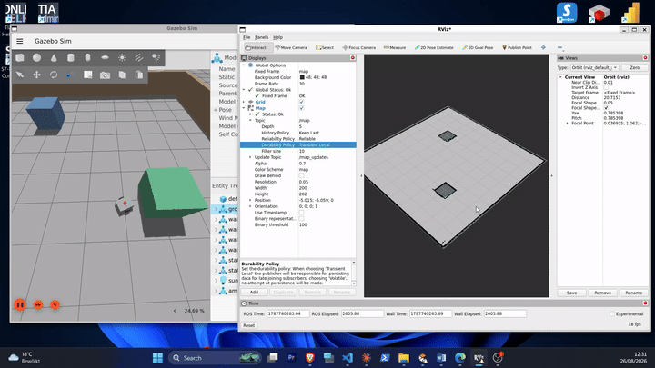
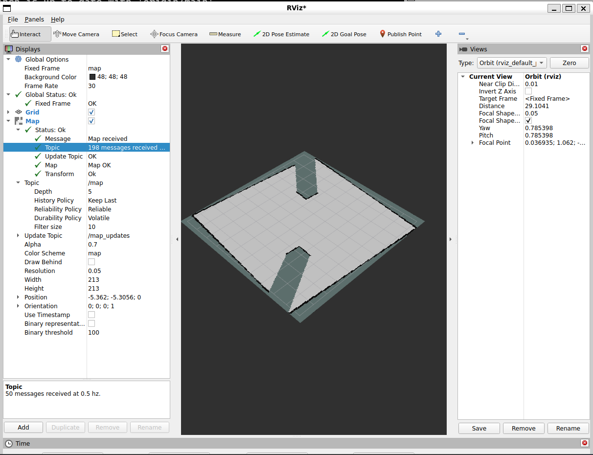
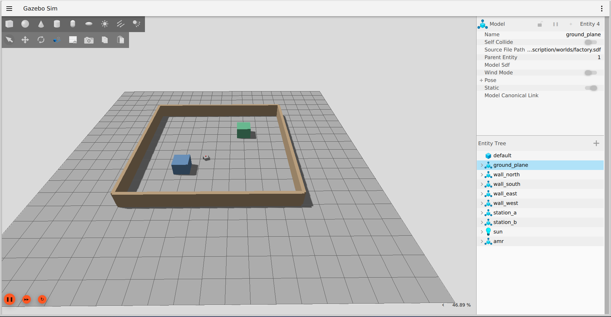

# ROS 2 Autonomous Industrial Material-Handling Robot

A simulated autonomous mobile robot (AMR) for industrial material handling, built with ROS 2 and Gazebo. The robot maps a factory environment via SLAM, then uses Nav2 to autonomously localize, plan paths, and navigate to goal poses while avoiding obstacles.

## Stack

- **ROS 2 Jazzy**
- **Gazebo Harmonic** (simulation, physics, sensors)
- **SLAM Toolbox** (2D occupancy grid mapping)
- **Nav2** (AMCL localization, path planning, MPPI-based path following)
- **URDF/Xacro** (robot description: differential-drive chassis, 2D LiDAR)
- **ros_gz_bridge** (ROS 2 ↔ Gazebo topic bridging)

## What it does

- Simulates a differential-drive robot with 2D LiDAR in a custom factory-style Gazebo world (walls, obstacle stations)
- Builds a live occupancy grid map of the environment using SLAM Toolbox as the robot drives
- Saves the map for reuse, then localizes against it using AMCL
- Plans collision-free paths with Nav2's global/local planners and follows them autonomously via the MPPI controller
- Automatically brings up SLAM on launch (no manual lifecycle activation required)

## Usage

### 1. Map a new environment (or skip if using the saved map)

```bash
ros2 launch amr_description slam.launch.py
```

SLAM Toolbox activates automatically. Click ▶ play in Gazebo, then drive the robot around with:

```bash
ros2 run teleop_twist_keyboard teleop_twist_keyboard
```

Once the map looks complete in RViz, save it:

```bash
ros2 run nav2_map_server map_saver_cli -f my_map
```

### 2. Navigate autonomously with a saved map

Deactivate SLAM if it's still running (it isn't needed once you have a saved map):

```bash
ros2 lifecycle set /slam_toolbox deactivate
```

Launch Nav2:

```bash
ros2 launch nav2_bringup bringup_launch.py use_sim_time:=true \
  map:=$HOME/ros2-industrial-amr/my_map.yaml \
  params_file:=$HOME/ros2-industrial-amr/src/amr_description/config/nav2_params.yaml
```

**Important:** open RViz and set an initial pose (2D Pose Estimate) within ~30 seconds of launching — the global costmap will fail to activate if it doesn't receive the `map → odom` transform in time.

Once localized, send goals via RViz's "2D Goal Pose" tool and the robot will plan and drive there autonomously.

## Notable problems solved

- **Frame mismatch**: Nav2's default config expects a `base_footprint` frame; this robot's URDF only defines `base_link`. Fixed by updating `base_frame_id` across `nav2_params.yaml`.
- **SLAM lifecycle**: `slam_toolbox` starts as an inactive lifecycle node by default. Added a `nav2_lifecycle_manager` node to `slam.launch.py` with `autostart: true` and `bond_timeout: 0.0` so it configures and activates itself on launch.
- **MPPI/controller frequency coupling**: The MPPI controller's internal `model_dt` must match `1 / controller_frequency` exactly — changing one without the other causes `controller_server` to crash on configure.
- **AMCL activation timing**: The global costmap won't activate until it receives the `map → odom` transform, which AMCL only publishes after receiving an initial pose estimate — and it gives up after ~30s if that pose isn't set in time.

## Status

- [x] Gazebo simulation with robot model and factory world
- [x] ROS 2 ↔ Gazebo bridge (cmd_vel, odom, tf, scan)
- [x] SLAM mapping with automatic lifecycle activation
- [x] AMCL localization against a saved map
- [x] Autonomous Nav2 navigation to goal poses with obstacle avoidance
- [ ] Multi-waypoint patrol routes (`navigate_through_poses`)
- [ ] Performance tuning for consistent real-time control loop rates


## Demo

Autonomous navigation with obstacle avoidance — the robot localizes against the saved map, plans a path, and drives around a factory station to reach the goal.



**Full-quality video:** https://github.com/user-attachments/assets/9a7d368c-e586-4e7e-bc01-477d57935a84

| RViz — localization, costmaps, and planned path | Gazebo — simulated factory environment |
|---|---|
|  |  |

